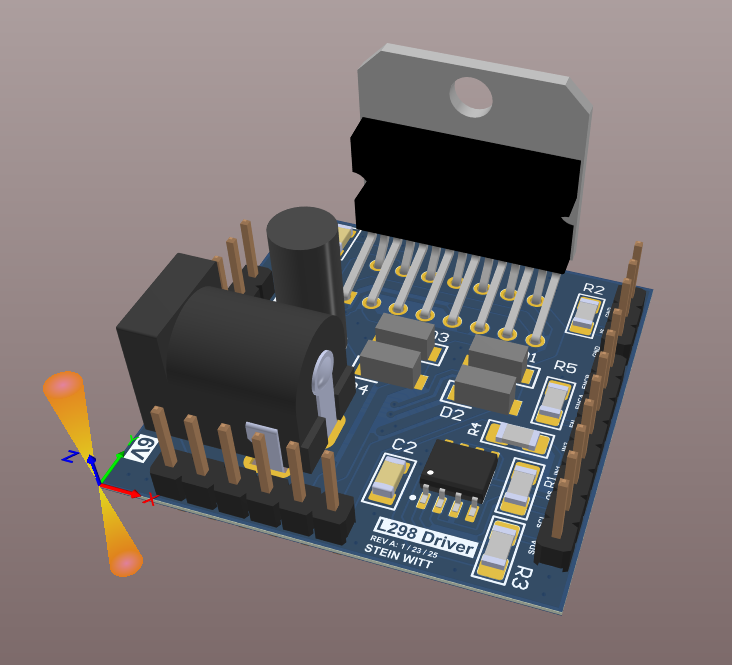
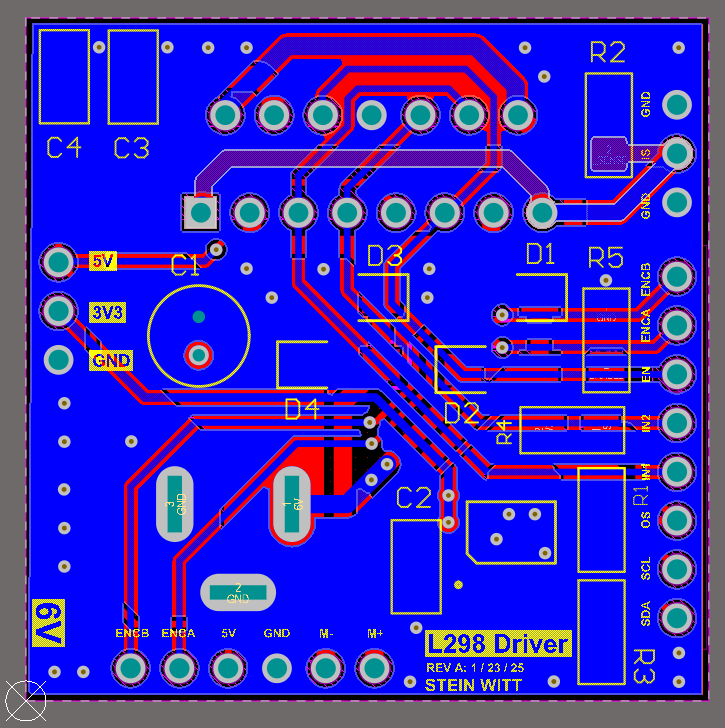

<h1 align="center">L298 Motor Driver PCB</h1>
  

    Designed a custom 2-layer PCB in Altium Designer that includes two voltage rails, H-Bridge drivers, I2C Temperature Sensors, and breakouts to connect to a MCU. The board was manufactured, assembled, and tested on multiple DC Brushed motors. An STM32 programmed in C was used to test the motor using a software implemented PID controller that utilizes the quadrature encoders on the DC motors to track position.
  

<h2 align="center">Isometric View</h2>
  

    
  

<h2 align="center">Top View</h2>
  

    
  

<h2 align="center">Bottom View</h2>
  

    
  

